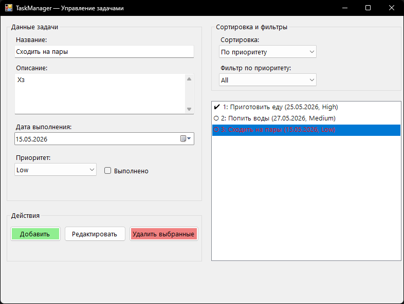

# TaskManager - Управление задачами

## Возможности
- Добавление, редактирование и удаление задач.
- Для каждой задачи задаются: название, описание, дата выполнения, приоритет (Low, Medium, High) и статус выполнения.
- Сортировка списка задач по дате выполнения (по возрастанию и убыванию) и по приоритету.
- Фильтрация списка задач по выбранному приоритету.
- Цветовая индикация: просроченные невыполненные задачи отображаются красным цветом.
- Поддержка множественного выбора и удаления задач через элемент ListBox.

## Требования к системе
- Операционная система: Windows 10 / 11
- Среда разработки: Visual Studio 2022 или новее
- Платформа: .NET Framework 4.7.2

## Инструкция по запуску
1. Откройте файл решения `TaskManager.slnx` в Visual Studio.
2. Дождитесь завершения загрузки проекта.
3. Нажмите клавишу `F5` или выберите в верхнем меню `Отладка` → `Начать отладку`.
4. После запуска используйте форму ввода слева для создания задач, результат отобразится в списке справа с учётом активных фильтров и сортировки.

## Автор
- Дюльденко Роман Дмитриевич
- Группа: 2ИСПпо-224-о